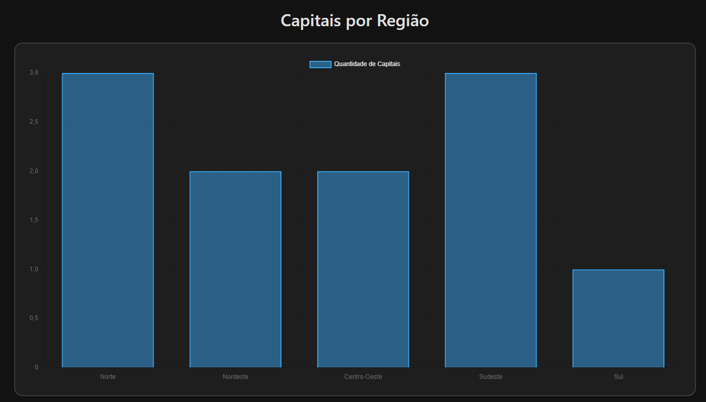
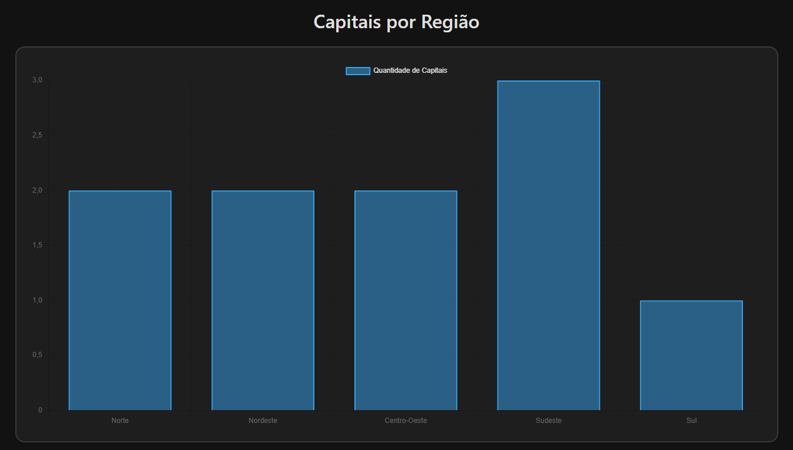

# Trabalho Prático 07 - Semanas 13 e 14

A partir dos dados cadastrados na etapa anterior, vamos trabalhar formas de apresentação que representem de forma clara e interativa as informações do seu projeto. Você poderá usar gráficos (barra, linha, pizza), mapas, calendários ou outras formas de visualização. Seu desafio é entregar uma página Web que organize, processe e exiba os dados de forma compreensível e esteticamente agradável.

Com base nos tipos de projetos escohidos, você deve propor **visualizações que estimulem a interpretação, agrupamento e exibição criativa dos dados**, trabalhando tanto a lógica quanto o design da aplicação.

Sugerimos o uso das seguintes ferramentas acessíveis: [FullCalendar](https://fullcalendar.io/), [Chart.js](https://www.chartjs.org/), [Mapbox](https://docs.mapbox.com/api/), para citar algumas.

## Informações do trabalho

- Nome: Enrico Guilherme Silva da Mata
- Matricula: 902513
- Proposta de projeto escolhida: Lugares e Experiências
- Breve descrição sobre seu projeto: Blog que mostra capitais do Brasil e pontos turísticos. Dinâmico com dados através de APIs e JSON Server.

**Print da tela com a implementação**

Nesta etapa foi implementada a apresentação dinâmica dos dados utilizando a biblioteca Chart.js. Criou-se uma nova página dedicada à visualização gráfica, onde os dados cadastrados no CRUD são buscados diretamente do JSON Server. Após a requisição, as capitais são processadas e agrupadas por região (Norte, Nordeste, Centro-Oeste, Sudeste e Sul). Esses valores são então exibidos em um gráfico de barras interativo, que se atualiza automaticamente conforme novos registros são adicionados, editados ou removidos.

